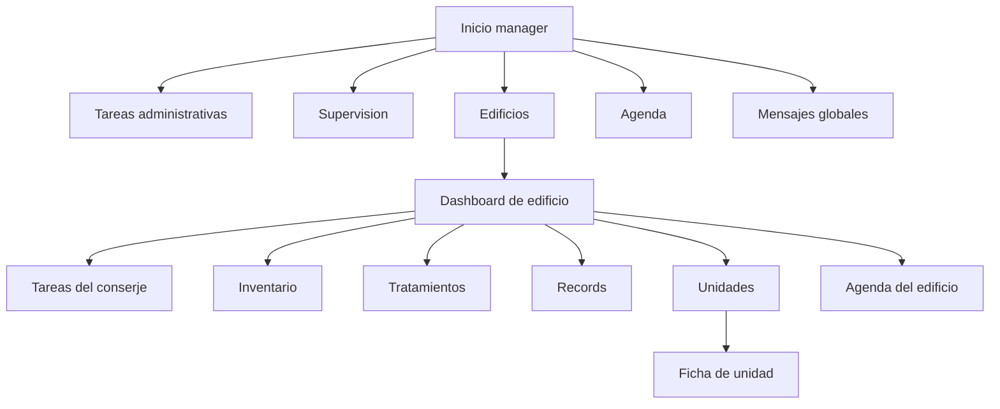
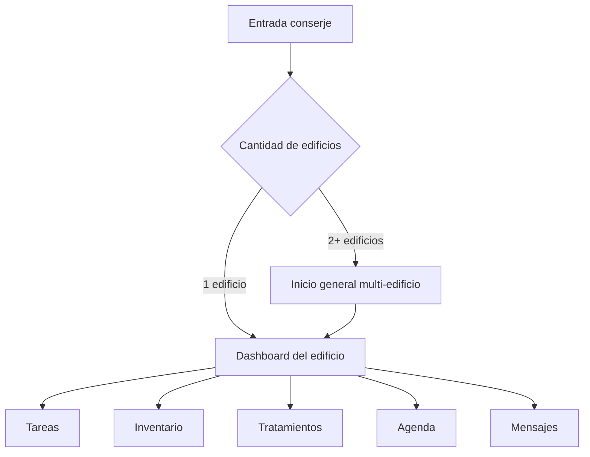
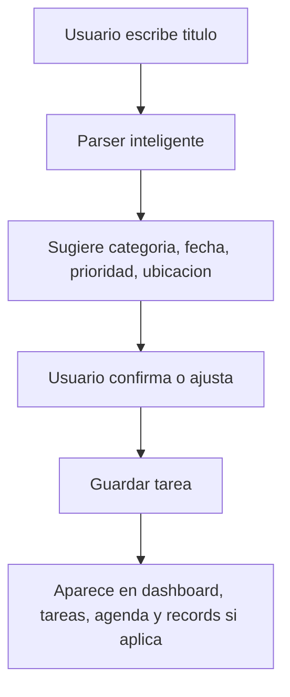
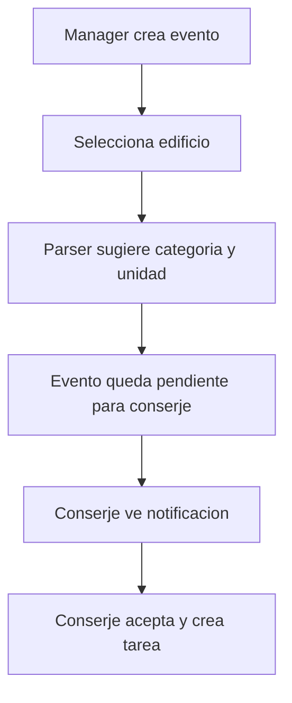
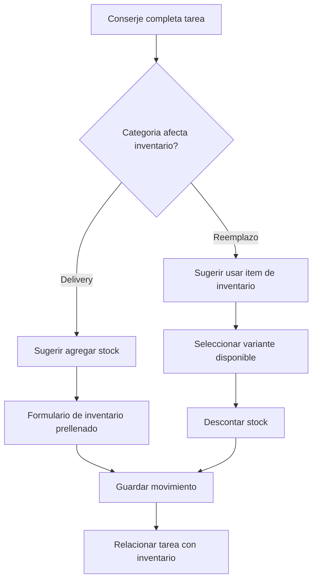
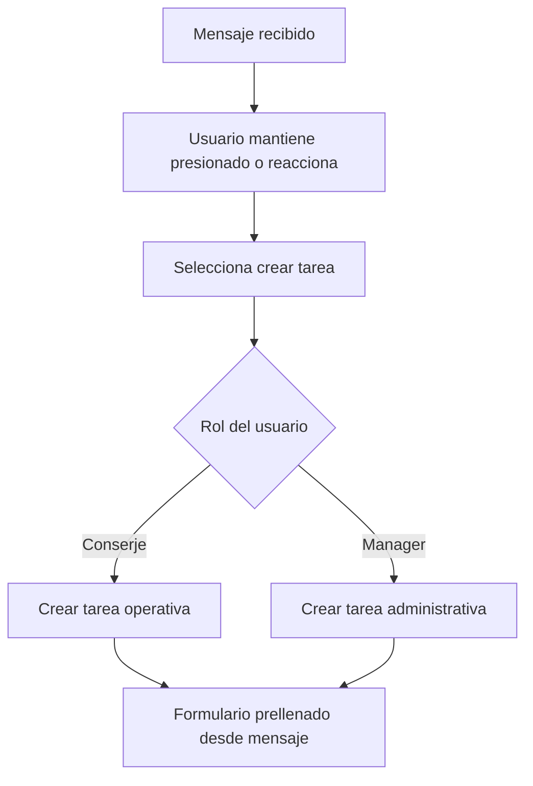
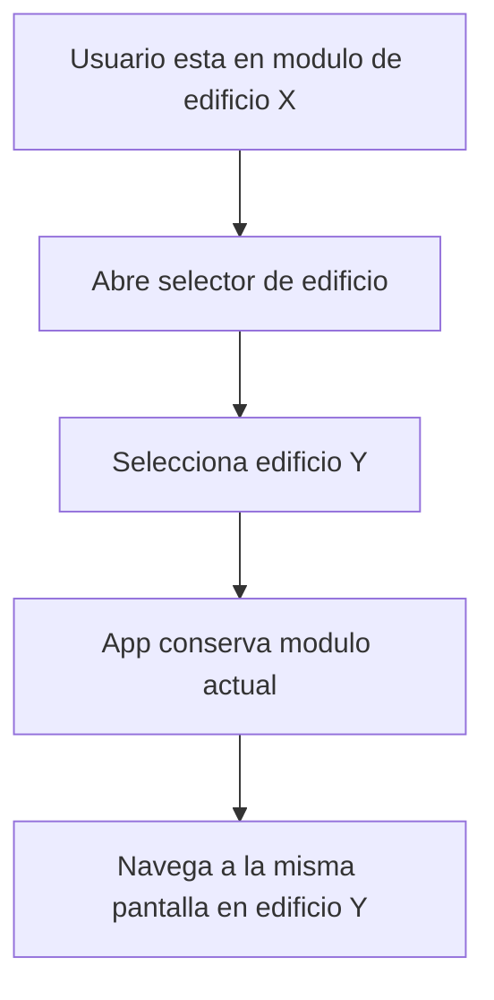
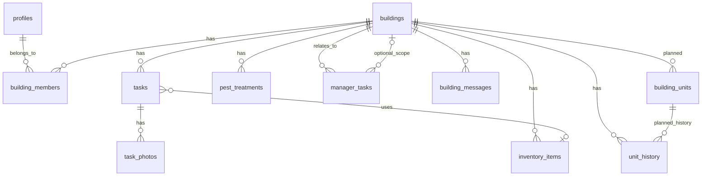

# Concierge App - mapa funcional del producto

Ultima actualizacion: 2026-04-22

Este documento resume las funcionalidades actuales y las funcionalidades planificadas de Concierge App. La idea es tener una vista completa del producto para detectar redundancias, priorizar mejoras y planificar futuras versiones.

## 1. Vision general

Concierge App es una plataforma operativa para edificios residenciales. Conecta managers, conserjes y edificios para gestionar tareas, agenda, inventario, tratamientos, mensajes, unidades/apartamentos, records y supervision.

El enfoque principal no es ser un sistema contable o inmobiliario completo. El valor central esta en la operacion diaria:

- Saber que hay que hacer hoy.
- Coordinar manager y conserje por edificio.
- Registrar historial por apartamento o area comun.
- Manejar inventario de materiales y equipos.
- Dar visibilidad rapida a edificios con problemas.
- Facilitar comunicacion multi-edificio.

## 2. Roles principales

### Manager / Administrador

Usuario que administra uno o varios edificios.

Funciones principales:

- Ver dashboard general.
- Ver dashboard por edificio.
- Crear tareas administrativas propias.
- Crear eventos para el conserje.
- Supervisar tareas operativas del conserje.
- Ver agenda personal.
- Ver agenda del edificio.
- Gestionar edificios vinculados.
- Ver records, inventario, tratamientos e historial por unidad.
- Exportar informacion a Excel.
- Comunicarse con conserjes por edificio.

### Conserje

Usuario operativo que trabaja en uno o varios edificios.

Funciones principales:

- Ver dashboard del edificio.
- Si tiene varios edificios, ver dashboard general multi-edificio.
- Crear tareas operativas.
- Completar tareas.
- Convertir eventos del manager en tareas.
- Manejar inventario.
- Registrar tratamientos de plagas.
- Ver agenda operativa.
- Ver records.
- Comunicarse con manager por edificio.

### Propietaria / Owner / Vista ejecutiva futura

Rol o vista de supervision con menos operacion diaria y mas indicadores.

Funciones esperadas:

- Ver estado general de edificios.
- Ver porcentaje de tareas completadas.
- Ver tareas atrasadas.
- Ver ultimos tratamientos.
- Ver alertas inteligentes.
- Exportar reportes ejecutivos.

## 3. Navegacion general

### Manager - navegacion principal

BottomNav del manager:

- Inicio
- Tareas
- Supervision
- Edificios
- Agenda

Dentro de un edificio, el manager usa una navegacion especifica del edificio:

- Dashboard
- Tareas
- Inventario
- Tratamientos
- Records
- Units / Unidades
- Agenda

### Conserje - navegacion principal

BottomNav del conserje:

- Inicio
- Tareas
- Inventario
- Tratamientos
- Agenda

## 4. Modulos actuales

## 4.1 Autenticacion y perfil

Pantallas:

- Login
- Signup
- Forgot password
- Setup profile
- Editar perfil

Caracteristicas:

- Registro como manager o conserje.
- Perfil con nombre, email, idioma y avatar.
- Foto de perfil personalizada.
- Avatar visible en headers.
- Cambio de idioma.
- Edicion de email desplegable.
- Para manager, la administracion de edificios se separa del perfil.

Pendiente o recomendado:

- Permisos mas granulares por rol.
- Flujo formal de invitaciones.
- Soporte para varios managers y varios conserjes por edificio.
- Roles futuros: owner, viewer, supervisor.

## 4.2 Gestion de edificios

Pantallas:

- Manager: Edificios
- Manager: Inicio con lista de edificios
- Conserje: selector o inicio multi-edificio

Caracteristicas actuales:

- Manager puede ver edificios vinculados.
- Manager puede conectar edificio existente con codigo.
- Manager puede crear edificio.
- Manager puede entrar al dashboard de un edificio.
- Conserje puede estar vinculado a uno o varios edificios.
- Cambio de edificio desde el header manteniendo contexto de pantalla.
- Navegacion entre dashboard general y dashboard especifico.

Caracteristicas planificadas:

- Desvincularse de un edificio.
- Eliminar edificio con permisos y confirmacion.
- Equipo del edificio: managers, conserjes y roles.
- Invitar usuario por codigo o invitacion.
- Editar datos del edificio.
- Imagen/foto del edificio.

## 4.3 Dashboard general del manager

Objetivo:

Dar al manager una vista rapida de su trabajo y de sus edificios.

Caracteristicas:

- Header con saludo, fecha, mensajes y perfil.
- Accion principal para crear:
  - Tarea administrativa.
  - Evento para conserje.
- Resumen de tareas administrativas:
  - Vencidas.
  - Hoy.
  - Proximas.
- Al tocar un resumen, funciona como semifiltro y muestra las tareas correspondientes.
- Lista de edificios.
- Cada edificio muestra:
  - Nombre.
  - Direccion.
  - Tareas del conserje de hoy.
  - Tareas del manager relacionadas con ese edificio.
- Acceso rapido al dashboard de cada edificio.

Pendiente o recomendado:

- Mensajes recientes globales si se decide volver a mostrarlos en Inicio.
- Alertas ejecutivas ligeras.
- Mejorar balance visual para muchos edificios.

## 4.4 Dashboard de edificio para manager

Objetivo:

Ver el estado operativo de un edificio especifico.

Caracteristicas:

- Header con edificio actual.
- Cambio de edificio manteniendo la pantalla actual.
- Acceso a vista general / Mis edificios.
- Contacto del conserje con foto y boton de mensaje.
- Resumen operativo.
- Eventos del manager para el conserje.
- Tareas del conserje organizadas por estado/fecha.
- Cards readonly para revisar tareas operativas.

Pendiente o recomendado:

- Adaptar dashboard al caso de varios conserjes en un mismo edificio.
- Mostrar equipo completo del edificio.
- Separar conversaciones por edificio y por participante.

## 4.5 Dashboard general del conserje multi-edificio

Regla:

- Si el conserje tiene 1 edificio, entra directo al dashboard del edificio.
- Si tiene 2 o mas edificios, entra a un inicio general operativo.

Caracteristicas:

- Header con saludo, fecha, mensajes y foto.
- Resumen corto del dia.
- Lista de edificios asignados.
- Cards con tareas pendientes, urgentes y tareas de hoy.
- Acceso rapido al edificio.

Pendiente o recomendado:

- "Continuar en ultimo edificio".
- Ordenar edificios por urgencia operativa.
- Mensajes recientes por edificio.

## 4.5.1 Vista general del edificio para conserje

Objetivo:

Permitir que el conserje vea rapidamente el estado general del edificio donde esta trabajando, no solo sus tareas del dia.

Esta vista funciona como un resumen operativo del edificio para el conserje. Debe ser mas simple que la vista ejecutiva del manager, pero suficientemente clara para entender el edificio.

Informacion recomendada:

- Total de apartamentos.
- Apartamentos ocupados.
- Apartamentos disponibles.
- Garajes asignados.
- Almacenamientos/storage asignados.
- Areas comunes registradas.
- Tareas pendientes del edificio.
- Tareas urgentes.
- Ultimos tratamientos o problemas recientes.

Ejemplo de resumen:

- 20 apartamentos.
- 18 ocupados.
- 2 disponibles.
- 14 garajes.
- 6 storage.
- 3 tareas pendientes.
- 1 tarea urgente.

Ubicacion recomendada:

- Dentro del dashboard del edificio del conserje.
- Como bloque superior llamado `Resumen del edificio` o `Estado del edificio`.
- Tambien puede estar disponible desde la pantalla de unidades cuando exista el modulo fuerte de apartamentos.

Distribucion recomendada:

- En el dashboard del edificio del conserje debe aparecer una version compacta.
- En la pantalla de Unidades/Apartamentos debe aparecer la version completa.

Version compacta en dashboard:

- Debe mostrar solo las metricas mas utiles para orientarse rapido.
- Recomendado: apartamentos, ocupados, disponibles, garajes y storage.
- Debe incluir un enlace o boton `Ver unidades` para ir al detalle.
- No debe ocupar demasiado espacio para no competir con las tareas importantes del dia.

Version completa en Unidades:

- Debe mostrar el desglose completo del edificio.
- Puede incluir apartamentos, areas comunes, garajes, storage, ocupacion, disponibilidad, contratos y alertas.
- Debe permitir entrar al detalle de cada apartamento o area comun.

Pendiente o recomendado:

- Este resumen deberia alimentarse de una tabla real de unidades/apartamentos.
- Debe actualizarse automaticamente cuando se agreguen o editen unidades.
- Debe distinguir apartamentos, areas comunes, garajes y storage.
- Puede servir como base para futuras alertas, por ejemplo apartamentos disponibles o contratos por vencer.

## 4.6 Tareas operativas del conserje

Categorias principales:

- Limpieza.
- Reparacion.
- Plagas.
- Pintura.
- Reemplazo.
- Entrega.
- Inspeccion.
- Visita.
- Otro.

Caracteristicas:

- Crear tarea manualmente.
- Parser inteligente para detectar:
  - Categoria.
  - Fecha.
  - Ubicacion/apartamento/area.
  - Prioridad.
- Seleccion de apartamento o area comun.
- Areas comunes separadas de apartamentos.
- Validacion de fecha local.
- Swipe:
  - Derecha para completar.
  - Izquierda para eliminar con confirmacion/undo.
- Expandir tarjeta para ver detalles.
- Editar tarea.
- Cambiar estado.
- Eliminar tarea.
- Tareas creadas desde eventos del manager tienen marca visual.
- Al completar delivery o reemplazo, se puede actualizar inventario.
- Si se usa inventario en reemplazo, se puede descontar del stock.
- Referencia entre tarea e item de inventario usado.

Pendiente o recomendado:

- Fotos antes/despues.
- Asignar tarea a un conserje especifico.
- Comentarios dentro de tarea.
- Historial de cambios de estado.

## 4.7 Tareas administrativas del manager

Objetivo:

Separar las tareas propias del manager de las tareas operativas del conserje.

Categorias actuales:

- Llamada.
- Email.
- Seguimiento.
- Documento.
- Pago.
- Reunion.
- Proveedor.
- Recordatorio.
- Otro.

Caracteristicas:

- Crear tarea administrativa desde Inicio, Tareas o Agenda.
- Puede estar relacionada con:
  - Tarea administrativa general.
  - Un edificio especifico.
- Parser inteligente para sugerir categoria, fecha, prioridad y edificio.
- Cards expandibles.
- Cambiar estado.
- Editar tarea.
- Eliminar tarea.
- Swipe para completar/eliminar.
- Resumen en Inicio.
- Filtros en Tareas.
- Vista calendario en Agenda.
- Exportar vista a Excel respetando filtros.

Pendiente o recomendado:

- Tareas administrativas recurrentes.
- Asignacion interna si hay varios managers.
- Relacionar una tarea administrativa con un mensaje, edificio, conserje o unidad.

## 4.8 Agenda

### Agenda del conserje

Caracteristicas:

- Calendario mensual.
- Tareas por dia.
- Crear nueva tarea.
- Exportar mes/vista.
- Boton claro para volver a hoy.
- Soporte multi-idioma en labels.

### Agenda del manager

Caracteristicas:

- Solo tareas administrativas del manager.
- Filtros por edificio y estado.
- Calendario mensual.
- Lista de tareas por dia.
- Crear tarea administrativa.
- Exportar vista a Excel.

### Agenda del edificio para manager

Caracteristicas:

- Eventos creados por manager para conserje.
- Vista de tareas/eventos por dia.
- Crear evento para conserje.
- El conserje puede aceptar evento y convertirlo en tarea.

Pendiente o recomendado:

- Rango de fechas para exportacion.
- Eventos recurrentes.
- Recordatorios/notificaciones.

## 4.9 Mensajes

Objetivo:

Comunicar manager y conserje manteniendo el contexto del edificio.

Caracteristicas:

- Conversacion por edificio.
- Icono global de mensajes.
- Bandeja global de mensajes.
- Conversaciones separadas por edificio, aunque sean las mismas personas.
- Reacciones a mensajes.
- Crear tarea desde mensaje.
- Manager puede crear tarea administrativa desde mensaje del conserje.
- Conserje puede crear tarea operativa desde mensaje del manager.

Regla importante:

No mezclar conversaciones de distintos edificios.

Ejemplo:

- Hector - Edouard-Montpetit.
- Hector - Cote Saint Luc.

Pendiente o recomendado:

- Mensajes recientes en home si aporta valor.
- Notificaciones push.
- Indicador persistente de mensajes/eventos pendientes.
- Soporte para multiples conserjes/managers en una conversacion de edificio.

## 4.10 Inventario

Objetivo:

Manejar stock de equipos, materiales y supplies del edificio.

Caracteristicas:

- Categorias globales simplificadas.
- Items y variantes.
- Nombre libre del articulo.
- Parser inteligente para sugerir categoria/item.
- Cantidad.
- Estado.
- Stock minimo.
- Ubicacion.
- Notas.
- Fotos.
- Historial de movimientos.
- Incremento rapido de stock.
- Modal para agregar inventario desde completar tarea.
- Variantes del mismo item.
- Exportacion a Excel con estilo.
- Filtros compactos por dropdown.
- Solo mostrar categorias/items con stock existente.

Ejemplo de estructura:

- Appliances
  - Estufa
    - Estufa Mabe 24"
    - Estufa usada con problema en piloto
  - Refrigerador
- Materiales
  - Pintura
  - Drywall
  - Cemento blanco
  - Cemento cola

Pendiente o recomendado:

- Trazabilidad por unidad instalada.
- Separar stock por ubicacion/deposito.
- Codigo de barras o QR.
- Alertas de stock bajo.
- Costos por item.

## 4.11 Tratamientos de plagas

Objetivo:

Registrar tratamientos, seguimientos y patrones por apartamento o area.

Caracteristicas:

- Categoria Pest control / Control de plagas.
- Historial por unidad.
- Registros por fecha.
- Filtros.
- Vista en Records.
- Alertas de tratamientos repetidos.

Pendiente o recomendado:

- Garantia por tratamiento.
- Proveedor/empresa del tratamiento.
- Tipo de plaga.
- Proximo seguimiento sugerido.
- Alertas tipo "Apto 12 con 3 fumigaciones recientes".

## 4.12 Records

Objetivo:

Centralizar historial de inventario, tratamientos y registros relevantes.

Caracteristicas:

- Records en BottomNav.
- Tratamientos.
- Inventario.
- Filtros.
- Exportaciones.
- Vista por edificio.

Pendiente o recomendado:

- Consolidar todos los tipos de historial.
- Vista por unidad desde Records.
- Busqueda global por apartamento, categoria o fecha.

## 4.13 Units / Unidades / Apartamentos

Estado actual:

- Vista de unidades derivada del historial.
- Apartamentos y areas comunes separados.
- Ficha de unidad.
- Resumen superior:
  - Ultima pintura.
  - Ultimo reemplazo.
  - Ultima reparacion.
  - Ultimo control de plagas.
- Cards resaltadas cuando hay informacion.
- Historial organizado por ano.
- Cada ano se expande al hacer click.
- Categorias:
  - Trabajos de pintura.
  - Reparaciones.
  - Reemplazos.
  - Control de plagas.
- Tareas expandibles con detalles.

Problema estructural actual:

La pantalla de unidades todavia depende mucho del historial/tareas. Para convertirla en un modulo inmobiliario fuerte, conviene crear una tabla real de unidades/apartamentos.

Plan recomendado:

- Crear tabla `building_units`.
- Guardar datos permanentes:
  - numero de apartamento.
  - tipo.
  - habitaciones.
  - banos.
  - estado: ocupado/disponible/problematico.
  - inquilino actual.
  - contrato.
  - garaje.
  - storage.
  - notas.
- Mantener `unit_history` como historial operacional.
- Conectar inventario instalado a unidad.

## 4.14 Supervision ejecutiva

Objetivo:

Dar una vista rapida del estado operativo de todos los edificios.

Caracteristicas actuales:

- Pantalla en BottomNav del manager.
- Metricas:
  - Porcentaje completado.
  - Tareas atrasadas.
  - Alertas.
- Resumen por edificio.
- Ultimo tratamiento.
- Alertas por unidad.
- Exportar supervision a Excel.

Pendiente o recomendado:

- Quitar exceso de color en cards de edificios.
- Filtros por periodo.
- Comparacion mensual.
- Ranking de edificios con mas problemas.
- Exportacion ejecutiva mas visual.

## 4.15 Exportaciones Excel

Exportaciones existentes o avanzadas:

- Inventario.
- Historial de unidades.
- Tareas administrativas del manager.
- Agenda/vista filtrada.
- Supervision.

Caracteristicas:

- Estilo consistente.
- Headers con color.
- Bordes.
- Auto filtros.
- Hojas por ano o por tipo cuando aplica.
- Respeta filtros en algunas vistas.

Pendiente o recomendado:

- Estandarizar todos los exports en una sola capa utilitaria.
- Agregar metadata:
  - edificio.
  - usuario.
  - fecha de exportacion.
  - filtros aplicados.
- Exportacion por rango de fecha.

## 4.16 Multi-idioma

Idiomas:

- Espanol.
- Ingles.
- Frances.
- Ruso.

Caracteristicas:

- Archivos de mensajes por idioma.
- Parser de tareas con sinonimos por idioma.
- Labels traducidos.
- Correcciones de encoding en JSON.

Pendiente o recomendado:

- Traduccion automatica de contenido escrito por usuarios.
- Guardar texto original y traducciones.
- Boton "Ver original".
- Cache de traducciones.

## 5. Flujos clave

## 5.1 Crear tarea operativa

## 5.2 Crear evento del manager para conserje

## 5.3 Completar tarea con inventario

## 5.4 Mensaje a tarea

## 5.5 Cambio de edificio manteniendo contexto

## 6. Modelo de datos conceptual

Entidades actuales o esperadas:

- `profiles`
- `buildings`
- `building_members`
- `tasks`
- `manager_tasks`
- `building_messages`
- `inventory_items`
- `inventory_history`
- `inventory_photos`
- `pest_treatments`
- `unit_history`
- `task_photos`
- `building_units` futura/recomendada

## 7. Reglas importantes de producto

### Edificios y usuarios

- Un manager puede tener varios edificios.
- Un conserje puede trabajar en varios edificios.
- Un edificio deberia poder tener varios managers.
- Un edificio deberia poder tener varios conserjes.
- Los permisos deben depender del rol dentro de ese edificio.

### Mensajes

- Las conversaciones no se mezclan entre edificios.
- Un mismo manager y conserje pueden tener una conversacion distinta por cada edificio.

### Tareas

- Tareas operativas pertenecen al edificio y normalmente al conserje.
- Tareas administrativas pertenecen al manager.
- Una tarea administrativa puede ser general o relacionada con un edificio.
- Eventos del manager no son tareas hasta que el conserje los convierte.

### Inventario

- Delivery tiende a incrementar stock.
- Reemplazo tiende a consumir stock.
- La tarea debe guardar referencia del item usado cuando aplique.

### Fechas

- Validar siempre con fecha local del usuario/edificio.
- Evitar crear eventos o tareas con fecha anterior a hoy, salvo que se permita explicitamente como registro historico.

## 8. Funcionalidades planificadas de alto valor

## 8.1 Importacion segura de apartamentos desde Excel

Objetivo:

Permitir que el manager cargue o actualice apartamentos sin destruir datos existentes.

Reglas:

- Excel vacio no borra datos.
- Dato lleno actualiza.
- Apartamento nuevo crea registro.
- Apartamento no presente se conserva.
- Preview antes de confirmar.
- Modo destructivo, si existe, debe estar protegido.

Requisito previo recomendado:

- Crear tabla real `building_units`.

## 8.2 Modulo fuerte de apartamentos

Objetivo:

Convertir Units en una pantalla central del edificio.

Funciones:

- Lista de apartamentos.
- Estado: ocupado, disponible, problematico.
- Inquilino actual.
- Contrato.
- Garaje/storage.
- Alertas.
- Historial.
- Inventario instalado.
- Fotos/documentos.

## 8.3 Fotos antes/despues en tareas

Objetivo:

Documentar visualmente trabajos.

Funciones:

- Foto antes.
- Foto despues.
- Galeria por tarea.
- Visible desde tarea, unidad y records.

## 8.4 Traduccion automatica

Objetivo:

Cada usuario escribe en su idioma y otros ven traduccion segun su perfil.

Reglas:

- Nunca reemplazar texto original.
- Guardar `source_locale`.
- Guardar traducciones en cache.
- Invalidar traduccion si cambia texto original.
- Boton "Ver original".

## 8.5 Equipo del edificio y permisos

Objetivo:

Soportar multiples managers y conserjes por edificio.

Funciones:

- Ver equipo.
- Invitar usuario.
- Desvincular usuario.
- Cambiar rol.
- Limites por plan de suscripcion.

## 9. Oportunidades de optimizacion

### 9.1 Reducir duplicacion de UI

Componentes candidatos:

- Headers de manager/conserje.
- Cards de tareas.
- Dropdowns.
- Export buttons.
- Empty states.
- Modales de confirmacion.

### 9.2 Separar mejor dominios

Dominios principales:

- `buildings`
- `tasks`
- `managerTasks`
- `inventory`
- `messages`
- `units`
- `treatments`
- `exports`
- `profile`

### 9.3 Consolidar parsers inteligentes

Hoy existen parsers para:

- Tareas operativas.
- Tareas administrativas.
- Inventario.
- Eventos.

Recomendacion:

- Mantener diccionarios separados por dominio.
- Reutilizar utilidades base:
  - normalizar texto.
  - detectar fecha.
  - detectar apartamento.
  - detectar prioridad.
  - detectar categoria por sinonimos.

### 9.4 Mejorar consistencia visual

Areas a cuidar:

- Tamano de textos.
- Espaciado de cards.
- Dropdowns.
- Headers con scroll.
- BottomNav con muchos items.
- Colores de alertas para no saturar.

### 9.5 Mejorar trazabilidad

Agregar historial para:

- Cambio de estado de tareas.
- Edicion de inventario.
- Desvinculacion de edificios.
- Cambios de roles.
- Cambios de unidad/contrato.

## 10. Priorizacion sugerida

### Prioridad alta

- Crear modelo real de unidades/apartamentos.
- Importacion segura desde Excel.
- Equipo del edificio: varios managers/conserjes.
- Fotos antes/despues en tareas.
- Refinar permisos por rol.

### Prioridad media

- Mejorar supervision ejecutiva.
- Agregar `Estado del edificio` compacto en el dashboard del conserje.
- Agregar resumen completo del edificio dentro de Unidades/Apartamentos.
- Exportaciones por rango.
- Alertas inteligentes.
- Mensajes recientes globales si se decide reintroducirlos.
- Mejorar dashboard de edificios/unidades.

### Prioridad estrategica

- Traduccion automatica.
- Planes y limites por suscripcion.
- Reportes ejecutivos avanzados.
- App movil/PWA mas pulida.
- QR/codigo de barras para inventario y unidades.

## 11. Preguntas abiertas para decidir

- Cual sera el rol exacto de "owner" versus "manager"?
- Un manager puede borrar un edificio o solo desvincularse?
- Los conserjes pueden ver tareas de otros conserjes del mismo edificio?
- Los mensajes del edificio deben ser 1 a 1 o grupales por equipo?
- Las tareas operativas se asignan a un conserje especifico o al edificio?
- El modulo de unidades debe incluir contratos e inquilinos desde la primera version?
- La importacion Excel debe permitir contratos desde el MVP o dejarlo para fase 2?
- El dashboard ejecutivo reemplaza o complementa Supervision?

## 12. Resumen corto

La app ya cubre una base operativa fuerte:

- Multi-edificio.
- Manager y conserje.
- Tareas.
- Agenda.
- Inventario.
- Tratamientos.
- Records.
- Mensajes.
- Exportaciones.
- Supervision.

La siguiente evolucion natural es convertirla en una plataforma mas estructurada de administracion operativa de edificios:

- Unidades reales.
- Equipo por edificio.
- Permisos.
- Importacion Excel.
- Fotos antes/despues.
- Alertas inteligentes.
- Reportes ejecutivos.
